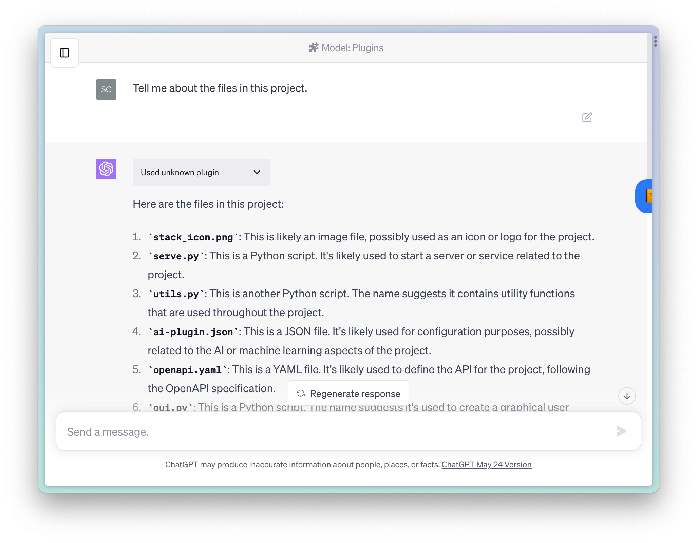
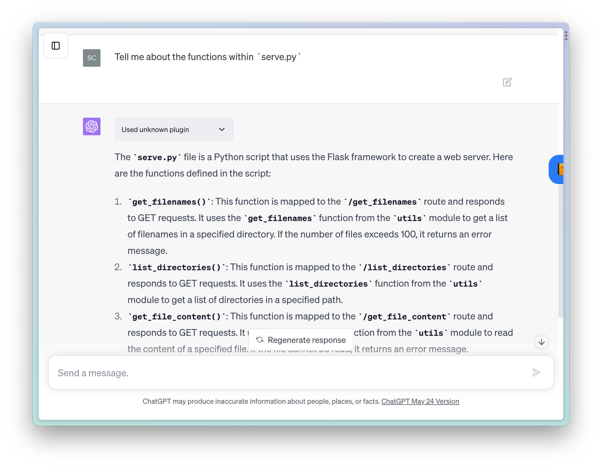

# ChatGPT Local Files Plugin

This plugin makes your local files accessible to ChatGPT via local plugin; allowing you to ask questions and interact with files via chat. Features and use-cases:

- Point to the base directory of code, allowing ChatGPT to read your existing code and any changes you make throughout the chat
- In addition to text files/code, also supports extracting text from PDF and DOCX files.

The core idea is based on something implemented in [kesor's fantastic chatgpt-code-plugin](https://github.com/kesor/chatgpt-code-plugin). 

You need Plugin Developer access for this.



# Setup

## 1. Clone the repository and install requirements
```
git clone git@github.com:samrawal/chatgpt-localfiles.git
cd chatgpt-localfiles
pip install -r requirements.txt
```

## 2. Launch the app:
- You can access via command-line or a GUI:
`python serve.py {path_to_your_base_directory}` OR `python gui.py`
- The GUI is currently macOS-only and comes with a GUI directory picker and taskbar icon when server is running.

## 3. Add the plugin to ChatGPT (only needs to be done once): *Note: you need Plugin Developer Access for this*
- Go to Plugins -> Develop your own plugin -> Type `localhost:9900`. *Make sure the app is running while you do this!*

## 4. Start a new chat, with the Local Files plugin enabled. ChatGPT should now have access to a list of your files and their contents.


